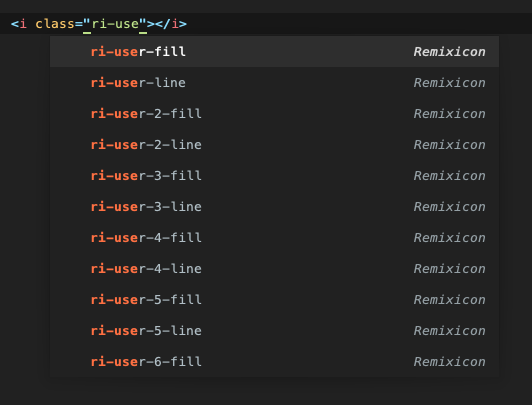

# remixicon-autocomplete by [etoundi.com](https://www.etoundi.com/)

[Remixicon](https://github.com/Remix-Design/RemixIcon) `v.3.4.0` autocomplete for Sublime Text.



### Installation
```bash
# add the repository to the Sublime packages directory
cd ~/Library/Application\ Support/Sublime\ Text/Packages/
git clone git@github.com/etoundi2nd/remixicon-autocomplete.git
```

### Contribution
```bash
# if you want to contribute to the project,
# creating a symlink to a directory of your choice might be helpful
ln -s ~/Library/Application\ Support/Sublime\ Text/Packages/remixicon-autocomplete ~/Documents/my-projects/remixicon-autocomplete
```

note: you can get the Sublime packages path in the Sublime menu:  
`Sublime Text > Preferences > Browse Packages…`


### Credits
Created based on [Tailwind CSS Autocomplete for Sublime Text 3/4](https://github.com/danklammer/tailwind-sublime-autocomplete) by [@danklammer](https://github.com/danklammer)
